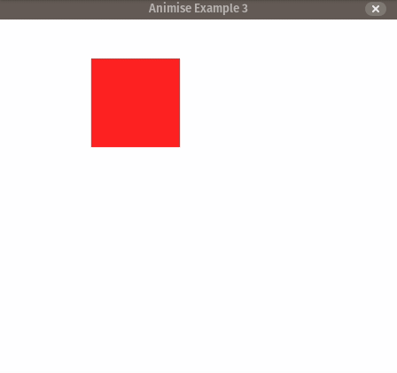
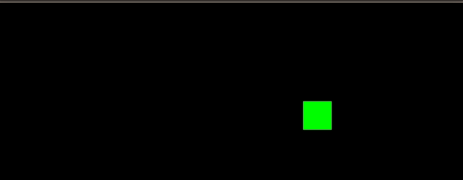

# Animise

*General purpose tweens and easing*

Animise is a small library that you may use to orchestrate any
time-varying numerical values. While animise is intended to be used as
a general purpose
[tweening](https://en.wikipedia.org/wiki/Inbetweening) solution for
your Common Lisp projects, you could use it for other purposes as well
(e.g. modulating audio signals).

As a taste of the animise language, here is a snip from an example
that animates a box with SDL2:

NOTE: These gifs are jumpier looking than the "real thing" - my gif
recorder makes chopy gifs I guess :(

    ;; ... snip
    
    (let* ((rect (sdl2:make-rect 0 0 100 100))
           (color (list 255 0 0 255))
        
      (anim 
        (sequencing (:loop-mode :looping :targeting rect)
          (pausing :for 200 :at (sdl2:get-ticks))
          (grouping (:for 1200)
            (animating :the 'cadddr :of color :to 0)
            (animating :the 'sdl2:rect-x :to 400 :by :quading-out)
            (animating :the 'sdl2:rect-y :to 300 :by :bouncing-out))
          (grouping (:for 1000)
            (animating  :the 'cadddr :of color :to 255)
            (animating :the 'sdl2:rect-x :to 0 :by #'elastic-out))
            (animating :the 'sdl2:rect-y :to 0 :for 800 :by :cubic-in-out))))

    ;; ... end snip

And here is what the above looks like

## More Examples

### Animating a few distinct properties at different "rates"

     (let* ((rect (sdl2:make-rect 0 0 100 100))
            (dur 2200)
            (dur/3 (round (/ dur 3)))
            (anim
              (sequencing (:loop-mode :looping :targeting rect :at (sdl2:get-ticks))
                (grouping (:for dur)
                  (animating :by :springing-out  :the 'sdl2:rect-x :to 500)
                  (animating :by :quading-out :the 'sdl2:rect-height :to 20)
                  (animating :by :quading-out :the 'sdl2:rect-width :to 20))
                (grouping (:for dur)
                  (animating :by :quading-out :the 'sdl2:rect-width :to 100)
                  (animating :by :quading-out :the 'sdl2:rect-height :to 100)
                  (animating :by :bouncing-out :the 'sdl2:rect-x :to 0))))
            (other-anim
              (sequencing (:targeting rect :loop-mode :looping :at (sdl2:get-ticks))
                (animating :by :quading-in-out :the 'sdl2:rect-y :to 150 :for dur/3 )
                (animating :by :quading-in-out :the 'sdl2:rect-y :to 0 :for dur/3))))
  

 Then to update each of the animations ~anim~ and ~other-anim~, the above calls

    (animise:run-tween anim (sdl2:get-ticks))
    (animise:run-tween other-anim (sdl2:get-ticks))

 before the start of the rendering step.

**** Making batches of animations to run

 The code is not quite as nice for this one, but not too bad:

     (let* ((animise::*duration* 1000)
            (rects (loop :for y :from 0 :to 48
                         :collect (sdl2:make-rect 1 (* y 8) 30 8)))
  
            (out-anims  (apply #'as-group
                               (loop :for (r . rest) :on rects
                                     :collect (animating :the 'sdl2:rect-x
                                                         :of r :to 620 :by :cubing-in-out
                                                         :at (1+ (* 100 (length rest)))))))
            (in-anims (apply #'as-group
                             (loop :for (r . rest) :on rects
                                   :collect (animating :the 'sdl2:rect-x
                                                       :of r :to 1 :by :cubing-in-out
                                                       :at (1+ (* 100 (length rest)))))))
            (anim (funcall #'in-sequence out-anims in-anims)))
  
       (setf (loop-mode anim) :looping)

